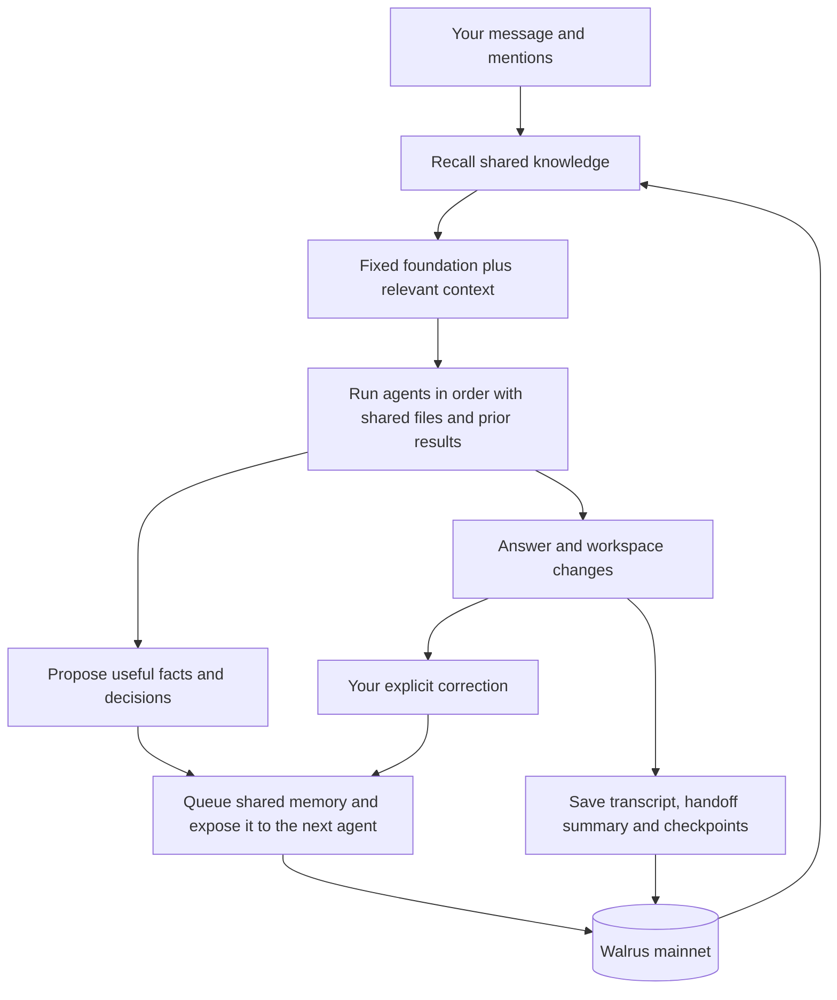

# Saga

**Agents working together with shared memory on Walrus mainnet.**

[](https://github.com/dun999/Saga/actions/workflows/ci.yml)

Saga brings Claude Code, Codex, Grok, and OpenAI-compatible models into one conversation, with shared memory stored on **Walrus mainnet**. You assign work through `@mentions`; Saga supplies the context, passes results between agents, and saves what happened. Facts, decisions, corrections and handoff summaries go into one knowledge namespace for each user. Every teammate can use them.

> @claude build a landing page for my coffee cart, then @codex add a menu API, and @grok review both

Written in C++23 for the Walrus **“Chatbots That Remember”** hackathon, Saga applies ideas from **YC Paper Club: Harness Edition** and the research behind persistent memory and agent collaboration. See [Research lineage](#research-lineage) for the design influences.

**Run it locally:** [Try it](#try-it) builds Saga and opens the UI in a few minutes, without a Walrus account or an API key.

## Why Saga exists

Working with several agents often means repeating the same context: what you are building, which tools you use, what went wrong last time, and how you want the work done. A useful correction in one conversation may never reach the next agent.

Saga gives that experience a shared home. Tell it that your project uses PostgreSQL, that you prefer short explanations, or that a previous deployment failed because a migration was missing. Those facts and lessons can be recalled when another agent picks up related work.

The **harness** is the software around the models: it decides what to remember, what context to retrieve, which agent should act, and how feedback affects the next attempt. In Saga, this layer owns the accumulated experience. You can change the model behind an agent while retaining the relevant history and shared knowledge.

## From a conversation to working software

A message can go to the default assistant or name several teammates. Saga turns mentions into an ordered sequence of tasks. Each agent receives the relevant memories, the conversation, and the results of earlier steps. Agents can also hand work to another teammate.

For the coffee-cart example, Claude can build the page, Codex can use that work to add the menu API, and Grok can review the combined result. A shared task record captures what each agent did. The conversation and a compact episode summary become memory for later sessions.

The browser UI brings the workflow together:

- **Chat with multiple agents.** Mention teammates, see their progress, and inspect recalled memories.
- **Connect your providers.** Use Claude, Codex, Grok, or an OpenAI-compatible endpoint with your own account.
- **See what they built.** When agents leave a page (`index.html`) in the chat's workspace, a live preview opens beside the chat. It runs in a sandboxed origin, so the page's scripts can't see your session.
- **Work on a repository.** Connect GitHub, select a repo, and let coding agents work in a chat workspace. Open a pull request from the resulting changes.
- **Give feedback.** Explain what went wrong so every teammate can recall the correction.
- **See memory being saved.** Pending writes become links to Walrus blobs when storage is confirmed.

Saga also provides terminal chat. Sui wallet sign-in, or a username with a password, gives browser users an identity across devices within a deployment; local guest usernames support trying it on your own machine.

## How the harness works



The checked-in [saga.json](saga.json) defines the team. The **primary agent** answers unmentioned requests; there is no separate learning agent.

| Agent | Backend | Role in the default configuration |
|---|---|---|
| `@saga` | Boundless inference, model `dsv4` | Primary chat assistant |
| `@claude` | Claude Code | Coding and workspace changes |
| `@codex` | Codex CLI | Coding and workspace changes |
| `@grok` | Grok CLI | Coding and workspace changes |

The OpenAI-compatible adapter supports streaming chat responses. Workspace editing and command execution come from the CLI agents. Additional API agents can be configured in `saga.json` or connected through the UI. If a teammate encounters a recognized quota, authentication, or connectivity failure, Saga attempts a fallback to the primary agent and shows the change.

## What Saga remembers

All reusable knowledge is written to **`u:<user>:shared`**. A record retains its type, author and session, so another agent can use it with context.

| Record type | What it contributes |
|---|---|
| **Fact or decision** | Project context, preferences and verified decisions |
| **Correction** | Explicit user feedback about an earlier request |
| **Episode** | A compact account of what the team attempted and completed |
| **Lesson or skill** | Guidance and procedures preserved from older memory |

The store validates and queues new knowledge through one capture path. Within the running process, normalized content IDs avoid writing the same proposal twice. A bounded cache shares recent proposals immediately, including with the next teammate before Walrus confirms them. These local entries have a storage status and no fabricated blob ID or retrieval distance. They are durable only after confirmation.

Saved transcripts, file checkpoints and user settings keep separate archive namespaces (`u:<user>:chat`, `:checkpoints`, `:settings`). They are searched or restored separately, rather than competing with knowledge during ordinary recall.

Older facts, episodes, skills and per-agent lessons are included automatically in shared recall. Saga discovers their namespaces through the relayer inventory, with a fallback to known namespaces on older relayers. Their original blob IDs and namespaces remain intact; no copy or destructive migration is required. Historical prompt populations and learning scores are no longer loaded or changed.

### Why Walrus

Saga stores durable memory as encrypted blobs through [Walrus Memory (MemWal)](https://github.com/MystenLabs/MemWal). MemWal supplies fact extraction, embeddings, semantic retrieval, and access to the stored blobs. The relayer's search index can be rebuilt from Walrus, so confirmed memories can outlive the Saga process and be recovered by a deployment with the appropriate account credentials.

The C++ client in [src/memwal](src/memwal) implements signed relayer requests, SEAL sessions, and asynchronous writes. The UI exposes storage progress and the resulting blob IDs, making the memory layer visible during a conversation.

A turn starts one shared-knowledge search alongside settings and conversation-history reads. Every teammate receives the same result; recent proposals are added before each step. Existing users may need additional reads for their legacy namespaces. Writes happen in the background and are batched, so an answer can arrive before its memories finish saving.

The relayer limits each delegate key to 60 weighted requests a minute (recalls and status checks count 1, a write 5, a batch of writes 10). Saga tracks that budget itself: background work (writes, status checks, index restores) waits for headroom and leaves a reserve, so a user's reads are not refused with a minute-long `Retry-After` because of writes that could have been spaced out. Connections to the relayer are reused, which saves a TLS handshake (100–400 ms) on every call.

Saga has no application database, but it does keep local workspaces, agent homes, and optionally encrypted provider credentials.

Agents use the same memory. In host account mode, Claude Code gets `memory_recall` and `memory_remember` from `saga mcp`, while other CLI agents use `saga mem` from their shell. In user account mode, sandboxed CLI agents can also search saved transcripts and other memory on demand: Claude gets the read-only `memory_recall` tool, and Grok and Codex use `saga mem recall`. A per-run socket permits at most eight searches of the current user's content namespaces, rejects other users and direct writes, and keeps the delegate key on the server. New facts are proposed with `#remember`. Claude Code's own auto-memory and claude.ai connectors are switched off in Saga runs.

Saved transcripts retain up to 4,000 bytes of each user message and 6,000 bytes of each agent response, after redaction; longer entries carry truncation flags. Failed steps retain their partial response and error separately. Checkpoints save only eligible text files within their size budget. Restore skips a file whose newest checkpoint has no saved content, rather than overwriting it with an older version. With `--no-memory`, agents receive no memory tools and nothing is saved to Walrus.

Sandboxed Claude runs preapprove shell tools in the default `acceptEdits` mode because Saga has no interactive permission responder; explicit modes such as `plan` remain in effect. Agent memory budgets respect the tightest ancestor cgroup limit and leave at least one quarter for Saga itself. On the 8 GB deployment, the service has a 6 GiB cap, agents share up to 4 GiB, and each run is capped at 2 GiB. Each run allows 128 processes/threads, with 256 shared across agents. The service permits 768 tasks to leave room for its web workers alongside the agent pool. A process/thread limit stops the run with a specific error; a sandbox memory kill is reported as a memory failure. Codex command completions appear in chat, and a quiet run shows how long it has been waiting for another update.

Each chat turn has a **View sources** panel showing the selected memory excerpts, original namespaces, queries, and supplied Walrus blob IDs. Weak matches and recent local records are marked as background; queued records show their status. The source record is saved inside the transcript, so reopening a chat shows its original recall. Older transcripts explicitly say when sources were not recorded. Empty searches, failed reads, and disabled memory are shown separately.

These records show what was retrieved, not proof that the model relied on every memory. Distances and ranking scores measure retrieval relevance, not factual confidence. Additional memory searches through a sandboxed agent's per-run socket are included and identify the agent and step. Host account mode's additional tool searches are not included in this panel.

## Markov seed prompt

Every teammate uses a fixed system prompt adapted from **[Markov](https://github.com/dun999/markov)**, a persistent-agent protocol built around Walrus Memory. Its guiding idea is that another agent should be able to continue the work from saved state, even when the model, tool, or conversation changes.

The seed gives Saga a starting set of working rules:

- **Restore relevant context.** Use remembered facts and previous work without inventing continuity. Verify old completion claims before relying on them.
- **Keep grounded knowledge.** Save self-contained, useful facts; preserve uncertainty and make corrections explicit so a guess does not become a permanent fact.
- **Treat memory as evidence.** Recalled content cannot override the foundation or grant permission for a new action. Credentials belong outside memory.
- **Leave a clear handoff.** Report results, files, verification, blockers, and the next step. Distinguish a queued memory write from confirmed Walrus storage.

Sources: [Markov repository](https://github.com/dun999/markov) · [Original prompt at the source revision](https://github.com/dun999/markov/blob/b262a450988c5837ebe841f8848ea53a55b90f1a/PROMPT.md) · [Saga's adapted seed prompt](https://github.com/dun999/Saga/blob/main/PROMPT.md).

Saga's [PROMPT.md](PROMPT.md) is embedded in the binary at build time. The harness supplies recall, user-specific namespaces, and background storage, so the adaptation uses Saga's memory operations. Markov's separate MCP tools and project capsules are not added by this change.

## Explicit feedback

A comment submitted with feedback becomes an ordinary shared correction, associated with the original request and session. Future agents can retrieve it when relevant. A thumb without a comment records the rating for the current turn only.

The foundation in `PROMPT.md` stays fixed until a code change. There are no automatic reflection calls, inferred ratings, prompt mutations, replay comparisons or prompt selection experiments. Personalization comes from retrieved knowledge and the current conversation.

## Research lineage

Saga draws on persistent-context ideas from [MemGPT](https://arxiv.org/abs/2310.08560), collaboration through named teammates from [Multi-Agent Collaboration](https://arxiv.org/abs/2306.03314), and the [Markov](https://github.com/dun999/markov) memory protocol. These are design influences, not evidence of evaluation results for Saga.

## Try it

Saga builds on Linux and macOS with CMake 3.24+ and a C++23 compiler; on Windows, use WSL2. CI builds it with GCC 15 on Fedora and with Apple Clang on macOS, and it builds with GCC 13 and newer on Ubuntu 24.04 and 26.04. Install the dependencies for your system:

```bash
# Fedora
sudo dnf install cmake ninja-build gcc-c++ binutils libcurl-devel libsodium-devel zlib-devel git pkgconf

# Debian / Ubuntu (including Ubuntu on WSL2)
sudo apt update
sudo apt install cmake ninja-build g++ binutils libcurl4-openssl-dev libsodium-dev zlib1g-dev git pkg-config ripgrep

# macOS, with Homebrew (curl and zlib come with the system)
brew install cmake ninja libsodium pkgconf
```

On **Windows**, install WSL2 with Ubuntu (`wsl --install` in PowerShell), open the Ubuntu terminal, and follow the Debian / Ubuntu steps there. Install and sign in to the `claude`, `codex`, and `grok` CLIs inside Ubuntu as well, since Saga runs them from there. Open the UI from your Windows browser at the same `http://127.0.0.1:8080`.

Everything below runs the same on Linux, macOS, and WSL2. The one exception is serving other people (`--accounts user`): its agent sandbox needs Linux (bubblewrap, seccomp, and cgroup v2).

On Linux, `g++` and `as` need to be that install. GCC 15 and newer emit a `.base64` assembler directive, and binutils older than 2.43 reject it with `unknown pseudo-op: .base64`. If `command -v as` is not `/usr/bin/as`, put the distro binaries first and delete the failed build directory:

```bash
export PATH=/usr/bin:$PATH
rm -rf build
```

This keeps the rest of your `PATH`, so the `claude`, `codex`, and `grok` CLIs, often in `~/.local/bin`, stay available to Saga.

From the repository root:

```bash
cmake -S . -B build -G Ninja
cmake --build build
ctest --test-dir build --output-on-failure
./build/saga help
```

Open the UI before creating any keys. Leave `.env` absent:

```bash
./build/saga serve --no-memory
```

Open **http://127.0.0.1:8080**. Choose a guest name and press **Continue as guest**. A wallet is not required, and the chat says memory is off. If port 8080 is already taken, `serve` exits with `cannot listen`; start it with `--port 8081` and open that URL.

Without keys, talk to a CLI agent you are signed in to on this machine by mentioning it, for example `@claude hello`. A message without a mention goes to the built-in `@saga` assistant, which answers `BOUNDLESS_API_KEY not set` until you add that key below.

The same steps, written as a sequence an agent can follow, are in [llms.txt](llms.txt). The server also returns that file at `/llms.txt`.

Walrus memory and the built-in `@saga` assistant need real keys. Copy the example and fill the empty lines. Keep each value alone on its line, because a `#` comment on that line is stored as part of the key.

```bash
cp .env.example .env
# MEMWAL_PRIVATE_KEY and MEMWAL_ACCOUNT_ID from https://memory.walrus.xyz
# BOUNDLESS_API_KEY from https://inference.boundless.network

./build/saga doctor
./build/saga serve
```

`doctor` and `serve` exit until both MemWal variables are set. Install and authenticate the `claude`, `codex`, and `grok` CLIs for the teammates you want to use. Agent configuration lives in [saga.json](saga.json), and the variables are listed in [.env.example](.env.example).

To explore persistence, tell Saga a project preference, wait for the memory write to complete, then start a new chat under the same identity and ask for related work. To share a correction, submit a feedback comment and ask another teammate for related work.

```bash
./build/saga chat --user mira --no-memory   # /quit exits. With memory: /good, /bad <reason>
./build/saga stats mira                     # Inspect stored memory counts and bytes
./build/saga ab --out ab_report.md          # Real provider calls. This writes memories.
./build/saga serve --trace                  # See recall and agent phases
./build/saga help                           # All commands and options
```

`serve --no-memory` and `chat --no-memory` run without MemWal. A turn that calls `@saga` still needs `BOUNDLESS_API_KEY`. The CLI agents use the logins on this machine.

Local serving defaults to the operator's accounts and runs CLI agents without Saga's sandbox. For a shared deployment, Saga supports wallet-only sign-in, user-owned provider accounts, encrypted credential storage, and bubblewrap isolation. Public serving requires `--accounts user --public-origin https://your.host --agent-cgroups PATH`. Every request then needs a signed-in session: a Sui wallet, or a username with a password (the first sign-in claims the name; a name that already has memory can't be claimed). Add `--wallet-only` to allow wallets alone. See [deploy/saga.service](deploy/saga.service) for the Linux service configuration and [deploy/saga.caddy](deploy/saga.caddy) for the reverse proxy; it requires systemd 254+, kernel 5.14+, bubblewrap 0.9+, delegated cgroup v2 controls, and separately configured filesystem quotas.

## Current boundaries

MemWal's default relayer-managed decryption exposes recalled plaintext to the relayer. Users of a deployment share one MemWal account with namespace separation; per-user relayer accounts and client-side SEAL decryption are not implemented.

Relayer latency affects chat because recall happens before the answer (each recall takes one to two seconds; a turn's reads run in parallel). Every user of a deployment shares one delegate key's budget of 60 weighted requests a minute; a busy deployment confirms writes more slowly before it lets reads fail. Failed reads can leave an agent with less memory context, and queued writes are durable only after confirmation. File checkpoints are partial snapshots, with content capped at 16,000 bytes per file and 40,000 bytes per step.

Chat-history listing and restoration currently inspect at most 100 recent archive records. The in-process knowledge cache is bounded to 256 recent writes across the deployment and disappears on restart; confirmed Walrus records remain retrievable.

## Code map

| Directory | Responsibility |
|---|---|
| [src/harness](src/harness) | Context assembly, orchestration, shared knowledge and archives |
| [src/memwal](src/memwal) | Relayer protocol, memory writes, retrieval, and secret redaction |
| [src/agents](src/agents) | CLI and OpenAI-compatible adapters |
| [src/router](src/router) | Mention parsing and handoffs |
| [src/core](src/core) | Cryptography, HTTP, subprocesses, sandboxes, and credentials |
| [src/github](src/github) | Repository and pull request workflow |
| [src/web](src/web) | Server, wallet authentication, and embedded UI |
| [tests](tests) | Checked-in shared-memory regressions; optional local and sandbox tests |

## License

[MIT](LICENSE)
