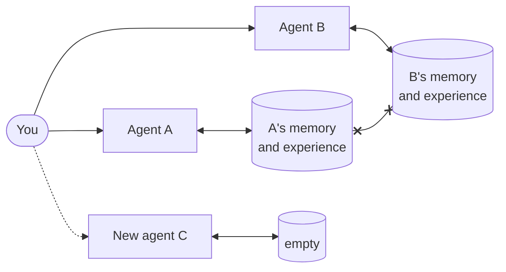
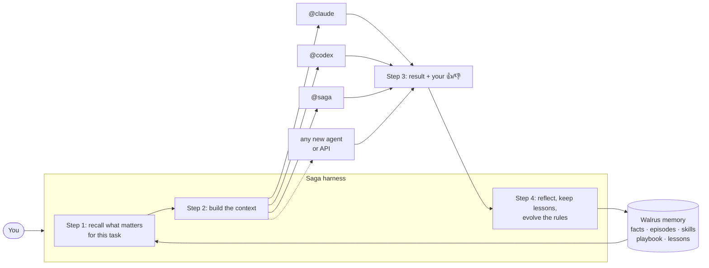

# Saga: agents that remember, chat that improve, on Walrus

[](https://github.com/dun999/Saga/actions/workflows/ci.yml)

Saga is a self-improving, multi-agent **harness** written in C++23. Plug in the coding agents you already
use (**Claude Code, Codex, Grok**) and any **OpenAI-compatible API** (xAI, OpenRouter, Groq, Ollama,
llama.cpp), then hand work between them with `@mentions`:

> build a landing page for my coffee cart, then **@codex** add a tiny API server for the menu, and **@grok** review both

Everything Saga learns is stored as encrypted blobs on **Walrus mainnet** through
[Walrus Memory (MemWal)](https://github.com/MystenLabs/MemWal): who you are, past tasks, per-agent lessons,
skills, the task blackboard and the evolving system prompt. There is **no database and no local state**.
Kill the process, boot it on another machine with the same delegate key, and Saga still knows you.

Built for the Walrus **"Chatbots That Remember"** hackathon, on the YC Paper Club *Harness Edition* reading
list (see [Research lineage](#research-lineage)).

---

## Memory on Walrus

| Namespace | Written when | Used by |
|---|---|---|
| `u:<you>:facts` | every message (relayer-side extraction, `/api/analyze`), and 👍/👎 comments | every agent, so preferences apply without being restated |
| `u:<you>:episodes`, `u:<you>:chat` | end of every turn | every agent, for continuity ("last time we built X…") |
| `task:<turn>` | after every agent step | every agent in the turn: a **blackboard**, so `@codex` sees what `@claude` built and why |
| `u:<you>:lessons:<name>` | reflection after 👍/👎 or an automatic failure | only your `@name` (Reflexion) |
| `u:<you>:skills` | 👍 on a successful multi-step turn | your agents, recalled for similar requests (Voyager) |
| `u:<you>:learning:prompts`, `u:<you>:learning:scores` | prompt evolution; every rating and credit tag | your system prompt (base + playbook rules), Thompson-sampled from your live versions |
| `u:<you>:cases` | every rated turn, explicit or implicit | the replay gate that tests a new prompt version |

Saga restores each user's learning namespaces when that user first needs them. The relayer's vector index is only a cache, and Walrus
is the source of truth.

### Every answer waits for its memory

Saga never answers without recalling first, so a turn is only as fast as the relayer's reads:

* A turn starts its facts, episodes and skills recalls together, and fetches each agent's lessons as soon as
  that agent is in the plan, so a handoff's lessons load while the previous agent is still working.
* Writes (transcripts, checkpoints, facts) never block. They queue on a background thread. The "saving to
  Walrus…" line under a reply becomes a blob id once Walrus confirms, usually 20–30 s later.
* Recalls normally take 1–2 s, but the hosted relayer sometimes stalls for minutes. We measured one recall
  at 302 s, and one server start that waited about 4½ minutes on its boot reads. The reply waits too,
  because an answer without its memory would defeat the point.
* The built-in `@saga` (`dsv4`) often takes 20–30 s, about as long as a Walrus write, so a reply can
  land just as the previous blob id appears. Neither one waited for the other.

`saga serve --trace` prints each phase of a turn to stderr: recalls started, recalled, and each agent
running and finished.

## The harness learns, not the agent

Usually each agent keeps its own memory (Claude Code's `CLAUDE.md`, Codex's files, a chatbot's history).
What one learns stays with it: tell Claude you deploy to Fly.io and Codex still doesn't know, and a new agent
starts from zero.



In Saga the **harness** owns the memory. Before any agent runs, it recalls what is relevant (who you are,
what happened, what worked, the rules it has learned) and hands it over with the task. After the turn it
decides what was learned and keeps it. Agents are interchangeable workers.



This is what makes Saga **agent-agnostic**. A new CLI or API knows you, your past work, the working skills
and the learned rules from its first turn. The improvement survives a model change, a new provider or a
restart. Even per-agent lessons ("@codex: run the tests before saying it's done") live in the harness,
keyed by `@name`. Swap the model behind `@codex` and they carry over.

## The self-improvement loop

```
 user msg ─► recall facts / episodes / skills / lessons ─► assemble context (prompt vN) ─► @agents
    ▲                                                                                        │
    │        👍/👎 + comment                                                                  ▼
    └── Thompson-sample ◄── replay gate ◄── playbook edit ◄── critiques ◄── reflection ◄── trace
        live versions      (child vs parent,  (add/edit/remove              (brain)    + signals:
                           blind judge)        rules, ACE)                               👍/👎, "no, …",
                                                                                         "thanks", PR opened
```

* **Signals, not just thumbs.** Besides 👍/👎, a reply starting "no, …" or "that's wrong" is an implicit
  👎 on the previous answer, "thanks" or "perfect" an implicit 👍, and opening a pull request a 👍 on the
  chat's last turn. Every rated turn becomes a replay case in the user's own namespace.
* **Reflexion.** Each signal triggers a reflection that writes lessons for the agent involved and marks which
  rules and lessons in context helped or hurt. One that hurts at least twice, and more often than it
  helps, is retired.
* **Playbook, not rewrites (ACE).** The system prompt is a fixed base plus short rules. Every 3 critiques the
  brain proposes at most three add/edit/remove edits, so working rules aren't lost in a rewrite.
* **Replay gate (Darwin Gödel Machine, GEPA).** Before a new version serves its owner, it answers that user's rated past
  messages next to its parent. A judge sees both answers
  in shuffled order, without knowing which is which, and picks the better one. A version that loses more
  than it wins is kept as `rejected` and never served, and one with nothing to replay isn't created at all.
  Thompson sampling over 👍/👎 then splits traffic among the live versions. `saga evolve "<critique>"
  --user NAME` runs one evolution on demand.
* **Skills.** A successful multi-agent procedure is distilled into a recallable skill.

## Quick start

```bash
# Fedora
sudo dnf install cmake ninja-build gcc-c++ libcurl-devel libsodium-devel
# Debian/Ubuntu
sudo apt install cmake ninja-build g++ libcurl4-openssl-dev libsodium-dev pkg-config

cmake -S . -B build -G Ninja && cmake --build build

cp .env.example .env               # add your delegate key + account id from https://memory.walrus.xyz
./build/saga doctor                # health → whoami → remember → Walrus blob → recall
./build/saga serve                 # http://127.0.0.1:8080

./build/saga chat --user mira      # terminal chat (/good, /bad <why>)
./build/saga stats                 # memories + bytes per namespace (hackathon: ≥10 blobs)
./build/saga ab                    # before/after experiment → ab_report.md
./build/saga restore u:mira:facts  # rebuild the relayer index from Walrus
./build/saga serve --no-memory     # the "before" baseline
```

## Serving other people

### Sign-in

* **Sui wallet.** Any Wallet Standard wallet (Slush, Suiet, Phantom, …) signs a one-time challenge, and
  your address becomes your Saga identity, so your memory follows your wallet across devices. Ed25519 is
  verified in C++. Every other scheme, including zkLogin ("Sign in with Google" in Slush), is verified by a
  Sui full node (`verifySignature` over GraphQL).
* **Username = guest mode.** Quicker, but it proves nothing: anyone who types that username gets its
  memory, and guests can't connect accounts. `--wallet-only` disables it. Guest mode starts only on
  this machine, with no `--public-origin` and no `--trust-proxy`.
* Wallet sessions use a random, opaque `HttpOnly` cookie that expires after one hour. Logout revokes it
  immediately; restarting the server also ends all sessions. Public HTTPS deployments mark it `Secure`.
  Vault keys and provider credentials are never put in the session cookie.

### Bring your own accounts

With `--accounts user` (also the default when `--host` is not loopback), each wallet user connects their
**own** providers in **Agents**, and nothing runs on the operator's plans. A public bind also needs
`--wallet-only` and `--public-origin` — see [Deploying](#deploying).

| Agent | How a user connects |
|---|---|
| `@saga` | nothing: the default agent, DeepSeek V4 Flash on [Boundless](https://inference.boundless.network), on the operator's `BOUNDLESS_API_KEY` |
| `@claude` | a token from `claude setup-token` (Claude subscription) or an Anthropic API key |
| `@codex` | **Sign in with ChatGPT** (device code in the browser) or an OpenAI API key |
| `@grok` | **Sign in with Grok** (device code) |
| ＋ | any OpenAI-compatible API with their own key. A user-owned agent reaches only public addresses, in host mode and in user mode. An agent configured in `saga.json` may still use a local model such as Ollama or llama.cpp |

Reflection and prompt evolution run on the user's own Claude account too.

**Credentials are sealed with the user's vault key.** At sign-in the wallet signs a fixed "Unlock your Saga
vault" message. Saga verifies that signature, derives the 32-byte key, and holds it only in the active server
session. A separate key derived for each user and provider encrypts tokens, API keys, Codex/Grok login files,
key hints and the GitHub username as XSalsa20-Poly1305 ciphertext. The server never writes the vault key
down. Standard wallets sign deterministically, so the same wallet recreates it on another device. If one
can't (for example, rotating-key Google wallets), Saga detects the mismatch and asks the user to reconnect.
**Disconnect deletes** the credential. GitHub OAuth connections are also revoked through GitHub when this
server has the OAuth app secret. See `/privacy`.
New connections last only for the current session unless the user selects **Remember this account on this
server**. Session-only credentials stay encrypted in server memory between operations and are discarded
on logout or expiry. Remembered connections stay encrypted on disk; temporary plaintext CLI files are
removed when the worker exits. Logout and expiry also cancel background learning jobs.

**Every user's agents run in a bubblewrap sandbox** (`bwrap` is required in this mode):

* Only system binaries, libraries, CA certificates, the user's provider-specific agent home and chat workspace enter
  the sandbox. Host runtime sockets, the operator's files and other users' homes are absent.
* Each call has its own network namespace. HTTPS passes through a CONNECT broker that checks the actual
  destination IP and refuses private, loopback and metadata addresses. Direct networking is disabled.
  CLIs must support `HTTPS_PROXY`; the broker supports HTTPS on port 443 and preserves TLS verification.
* The environment is cleared, so the Walrus delegate key never reaches an agent. Provider tokens enter
  through the sandbox environment and prompts through stdin or a 0600 file. Neither goes on a command line,
  which any local user could read with `ps`.
* Provider logins live in separate 0700 homes, sealed except while that provider's call runs, and are
  never written to Walrus. When the last call ends, everything the CLIs wrote (transcripts with prompts
  and recalled memories, their memory files, logs, caches) is deleted. Only the sealed logins and Codex's
  plan-usage numbers remain.
* Restoring a checkpoint and reading, sealing or deleting credentials use pinned directory descriptors
  and never follow a link an agent left behind.

**GitHub.** Connect a fine-grained token, or "Sign in with GitHub" when `SAGA_GITHUB_CLIENT_ID` points at an
OAuth App with device flow, then pick a repo from the chat bar. Saga clones it into that chat's sandboxed
workspace on branch `saga/<chat>` and tells every agent to commit there. **Open pull request** commits
leftovers, pushes and opens (or updates) the PR. The token never enters the agents' clone, since agents
control everything in it (config, hooks, filters). Instead, the push runs from a fresh blob-less clone of
GitHub that fetches only the branch's new commits from the workspace. Agents can commit, but they can't
push or see the token.

### Deploying

A public address, or a reverse proxy in front of a loopback bind, starts only with
`--accounts user --wallet-only --public-origin https://your.host --agent-cgroups PATH`. Guest mode is for this machine: no
public origin, and no `--trust-proxy`.

Public serving needs Linux cgroup v2, kernel 5.14 or newer, bubblewrap 0.9 or newer, and an empty delegated
subtree separate from the server process. Startup verifies namespaces, the broker, resource controls and
process migration before accepting requests. An example service is in [deploy/saga.service](deploy/saga.service);
edit its host name and paths before installing it. The service uses systemd 254 or newer to place the
server in its own subgroup. Run Saga as a dedicated unprivileged user and terminate TLS at the reverse proxy.

Each CLI call is limited to 2 GiB of memory, 64 processes and two CPUs. All calls together share a 4 GiB,
256-process, two-CPU budget. Calls stop at their deadline, on cancellation, or after 8 MiB of combined
output; unfinished stream lines stop at 1 MiB. Provider responses and browser event queues are bounded too.
The workspace and agent-home filesystem also needs an operator-configured disk quota; cgroups do not
limit persistent disk usage. Choose quota sizes for the projects the deployment accepts.

`--public-origin` is the one name Saga puts in wallet challenges and the GitHub OAuth callback. A request
whose `Host` is something else is rejected. `X-Forwarded-For` is read only with `--trust-proxy`, and only
when the connection itself comes from loopback. An `https://` origin marks the session and auth cookies
`Secure`; `--secure-cookies` does the same on a TLS terminator you configured.

User-owned API agents require HTTPS and open only public addresses, including when the operator runs host mode. Agents from
`saga.json` can still reach a local Ollama or llama.cpp. Built-in agents that spend the operator's keys
share one daily run budget (`--operator-budget`, default 1000, `0` for unlimited), so a new wallet does
not receive a fresh operator quota.

Each person still has 4 live tabs and 3 running chats. The process also caps live tabs, running chats,
queued background work, and — once the server is exposed — requests per minute. `--allow 0x…,0x…` remains
for an invite-only deployment and implies wallet sign-in.

Operator accounts (`--accounts host`) run agents as you **without a sandbox**, so they can read the host's
files (including `.env`) and each other's memory. Use them only for people you trust, on this machine.
There, Connect and Disconnect run the CLIs' own sign-in and sign-out on the host, and only when Saga
listens on loopback.

Before a memory is written, keys, tokens, passwords, and unlabelled 64-character hex strings are replaced
with `[redacted secret]`. A wallet address or content hash Saga already stores as a typed identifier is
kept. The filter matches those recognisable shapes.

## Agents and LLMs

Agents are configured in `saga.json`:

| kind | backend | notes |
|---|---|---|
| `claude-code` | `claude -p --output-format stream-json` | the default *brain* (`--tools ""`) |
| `codex` | `codex exec --json -s workspace-write` | set `model` to one your plan allows |
| `grok-cli` | `grok -p --output-format streaming-messages-json` | |
| `openai` | `POST {base_url}/chat/completions` (streaming) | xAI, OpenRouter, Groq, Together, **Ollama / llama.cpp** |

If a teammate is out of quota, unauthenticated or unreachable, its step goes to the primary agent and the
UI shows the fallback, so the user still gets a result.

**LLMs used in this submission:** Claude (via Claude Code) as the primary agent and brain, OpenAI Codex and
xAI Grok as `@`-mentionable teammates, and DeepSeek V4 Flash on Boundless as the built-in `@saga`.
MemWal runs fact extraction and embeddings server-side.

## The C++ MemWal client

There is no official C++ SDK, so `src/memwal/` implements the relayer protocol directly with libsodium,
ported from the relayer source (`services/server/src/auth.rs`) and the Python SDK:

* **Signed requests:** Ed25519 over `{ts}.{METHOD}.{path}.{sha256(body)}.{nonce}.{account_id}`, sent as
  `x-public-key`, `x-signature`, `x-timestamp`, `x-nonce` (UUIDv4) and `x-account-id`.
* **SEAL session** (`x-seal-session`): a fresh Ed25519 session key plus a Sui *PersonalMessage* signature
  (`blake2b256(0x03 0x00 0x00 ‖ uleb128(len) ‖ msg)`) over "Accessing keys of package … for 5 mins from …".
  The session key is encoded as a bech32 `suiprivkey` and cached until 30 s before expiry.
* **Writes** go through `/api/remember/bulk` (≤20 per call) on a background thread, which polls each job
  until Walrus returns a blob id. The UI shows each blob live, linked to Walruscan.

## Layout

```
src/core/      crypto (libsodium), http (libcurl), proc (subprocess streaming), sandbox, secrets, .env
src/memwal/    relayer client + async Store (write queue, job tracking)
src/agents/    Claude Code / Codex / Grok CLI adapters, OpenAI-compatible adapter, registry
src/router/    @mention parsing (user messages + agent handoff lines)
src/harness/   context assembly, orchestration, reflection, prompt population
src/github/    repo clone, branch push, pull requests
src/web/       cpp-httplib server (NDJSON chat stream, SSE write feed), wallet auth, embedded UI
```

## Honest limits

* Saga has no database, but the hosted relayer keeps a vector index (in Postgres) over your encrypted blobs.
  `restore()` rebuilds it from Walrus, which is what makes Walrus the durable record.
* With relayer-managed decryption (the MemWal default), the relayer sees plaintext while it serves a recall.
  Client-side SEAL mode isn't implemented yet.
* All users of a deployment share one MemWal account, isolated by namespace. Per-user relayer accounts are
  future work. Lessons, skills, critiques, prompt versions and replay cases stay in their owner's namespaces.
  Legacy shared lessons and playbooks are no longer read or replayed. Existing personal facts, chats and
  checkpoints remain available; private learning starts from the seed prompt after this upgrade.
* When the hosted relayer stalls, the chat stalls with it (see
  [Every answer waits for its memory](#every-answer-waits-for-its-memory)).

## Research lineage

The design follows **YC Paper Club: Harness Edition** (Aug 26, 2026), compiled as DAIR.AI's
[Harness Engineering collection](https://academy.dair.ai/papers/collections/harness-engineering):

* Yao et al., *ReAct* (2022): the interleaved act/observe loop each agent runs. [arXiv:2210.03629](https://arxiv.org/abs/2210.03629)
* Shinn et al., *Reflexion* (2023): verbal lessons from feedback, persisted here per agent. [arXiv:2303.11366](https://arxiv.org/abs/2303.11366)
* Wang et al., *Voyager* (2023): a skill library for reusable procedures. [arXiv:2305.16291](https://arxiv.org/abs/2305.16291)
* Packer et al., *MemGPT* (2023): memory as managed, tiered context. [arXiv:2310.08560](https://arxiv.org/abs/2310.08560)
* Talebirad & Nadiri, *Multi-Agent Collaboration* (2023): addressable agents with roles, here `@mentions`. [arXiv:2306.03314](https://arxiv.org/abs/2306.03314)
* Khattab et al., *DSPy* (2023) and Agrawal et al., *GEPA* (2025): the system prompt as an optimised artifact, evolved from failed traces. [arXiv:2310.03714](https://arxiv.org/abs/2310.03714), [arXiv:2507.19457](https://arxiv.org/abs/2507.19457)
* Zhang et al., *Agentic Context Engineering* (2025): an evolving playbook with helpful/harmful counters, edited in small deltas to avoid context collapse. [arXiv:2510.04618](https://arxiv.org/abs/2510.04618)
* Zhang et al., *Darwin Gödel Machine* (2025): a self-modification is kept only after it is validated on real tasks. [arXiv:2505.22954](https://arxiv.org/abs/2505.22954)
* Lee et al., *Meta-Harness* (2026) and Karten et al., *Continual Harness* (2026): adapting the harness online around fixed weights. [arXiv:2603.28052](https://arxiv.org/abs/2603.28052), [arXiv:2605.09998](https://arxiv.org/abs/2605.09998)

## License

MIT
