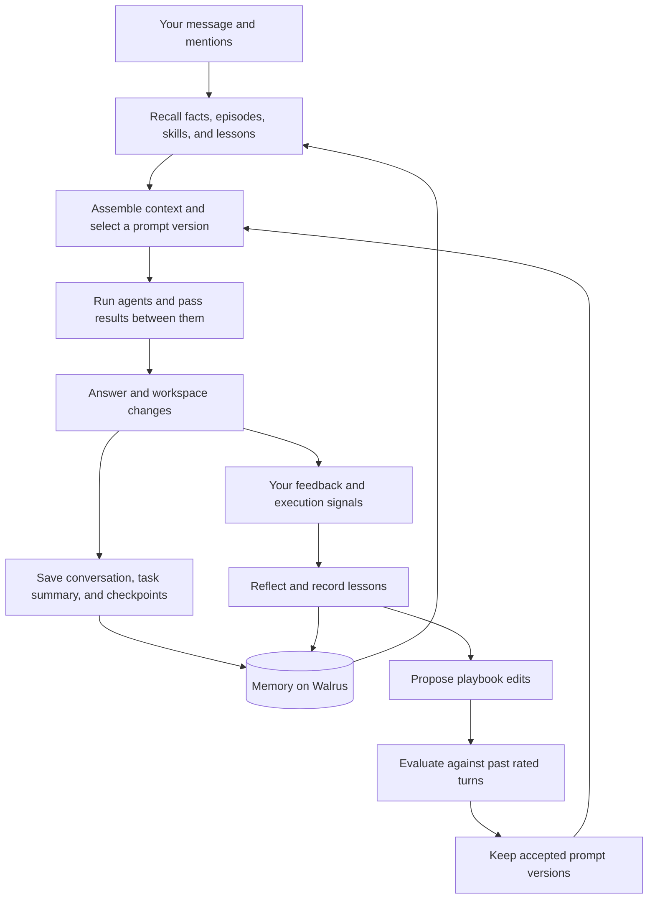

# Saga

**A multi-agent harness that remembers your work and learns from your feedback.**

[](https://github.com/dun999/Saga/actions/workflows/ci.yml)

Saga brings Claude Code, Codex, Grok, and OpenAI-compatible models into one conversation, with shared memory stored on **Walrus mainnet**. You assign work through `@mentions`; Saga supplies the context, passes results between agents, and saves what happened. Feedback becomes lessons, reusable skills, and changes to the instructions that guide future work.

> @claude build a landing page for my coffee cart, then @codex add a menu API, and @grok review both

Written in C++23 for the Walrus **“Chatbots That Remember”** hackathon, Saga applies ideas from **YC Paper Club: Harness Edition** and the research behind persistent memory, agent collaboration, and self-improving harnesses. See [Research lineage](#research-lineage) for the papers and how they inform the implementation.

**Run it locally:** [Try it](#try-it) builds Saga and opens the UI in a few minutes, without a Walrus account or an API key.

## Why Saga exists

Working with several agents often means repeating the same context: what you are building, which tools you use, what went wrong last time, and how you want the work done. A useful correction in one conversation may never reach the next agent.

Saga gives that experience a shared home. Tell it that your project uses PostgreSQL, that you prefer short explanations, or that a previous deployment failed because a migration was missing. Those facts and lessons can be recalled when another agent picks up related work.

The **harness** is the software around the models: it decides what to remember, what context to retrieve, which agent should act, and how feedback affects the next attempt. In Saga, this layer owns the accumulated experience. You can change the model behind an agent while retaining the relevant history, skills, and learned instructions.

## From a conversation to working software

A message can go to the default assistant or name several teammates. Saga turns mentions into an ordered sequence of tasks. Each agent receives the relevant memories, the conversation, and the results of earlier steps. Agents can also hand work to another teammate.

For the coffee-cart example, Claude can build the page, Codex can use that work to add the menu API, and Grok can review the combined result. A shared task record captures what each agent did. The conversation and a compact episode summary become memory for later sessions.

The browser UI brings the workflow together:

- **Chat with multiple agents.** Mention teammates, see their progress, and inspect recalled memories.
- **Connect your providers.** Use Claude, Codex, Grok, or an OpenAI-compatible endpoint with your own account.
- **Work on a repository.** Connect GitHub, select a repo, and let coding agents work in a chat workspace. Open a pull request from the resulting changes.
- **Give feedback.** Rate an answer or explain what went wrong so Saga can reflect on the attempt.
- **See memory being saved.** Pending writes become links to Walrus blobs when storage is confirmed.

Saga also provides terminal chat. Sui wallet sign-in gives browser users an identity across devices within a deployment; local guest usernames support trying it on your own machine.

## How the harness works



The checked-in [saga.json](saga.json) defines the agents and separates two responsibilities: the **primary agent** answers unmentioned requests, while the **brain** handles reflection and prompt evolution.

| Agent | Backend | Role in the default configuration |
|---|---|---|
| `@saga` | Boundless inference, model `dsv4` | Primary chat assistant |
| `@claude` | Claude Code | Coding and workspace changes |
| `@codex` | Codex CLI | Coding and workspace changes |
| `@grok` | Grok CLI | Coding and workspace changes |
| `claude-brain` | Claude Code, model `sonnet` | Internal reflection and prompt evolution |

The OpenAI-compatible adapter supports streaming chat responses. Workspace editing and command execution come from the CLI agents. Additional API agents can be configured in `saga.json` or connected through the UI. If a teammate encounters a recognized quota, authentication, or connectivity failure, Saga attempts a fallback to the primary agent and shows the change.

## What Saga remembers

Memory serves several purposes. Personal facts shape how an agent responds; episodes provide continuity; lessons help avoid repeating mistakes; skills preserve useful procedures.

| Memory | What it contributes to future work |
|---|---|
| **Facts and preferences** | Who you are, your project context, and how you like to work |
| **Conversations and episodes** | What was discussed, attempted, and completed, including what each teammate did in a shared task |
| **Per-agent lessons** | Guidance learned from feedback on a particular agent's work |
| **Skills** | Reusable procedures distilled from successful multi-agent tasks |
| **Prompt versions and scores** | The evolving rules used to guide agents and the feedback they received |
| **Replay cases** | Rated past requests used to evaluate proposed prompt changes |
| **File checkpoints** | Size-limited snapshots of files created or changed during a step |

Personal memory and learning records live in namespaces such as `u:<user>:facts`, `u:<user>:lessons:<agent>`, and `u:<user>:learning:prompts`. Queued playbook critiques live in `u:<user>:learning:critiques`, so prompt evolution picks up where it left off after a restart.

### Why Walrus

Saga stores durable memory as encrypted blobs through [Walrus Memory (MemWal)](https://github.com/MystenLabs/MemWal). MemWal supplies fact extraction, embeddings, semantic retrieval, and access to the stored blobs. The relayer's search index can be rebuilt from Walrus, so confirmed memories can outlive the Saga process and be recovered by a deployment with the appropriate account credentials.

The C++ client in [src/memwal](src/memwal) implements signed relayer requests, SEAL sessions, and asynchronous writes. The UI exposes storage progress and the resulting blob IDs, making the memory layer visible during a conversation.

Every read a turn needs starts at once: facts, episodes, skills, the agents' lessons, and, on a user's first turn since a restart, their prompt population, settings and chat history. The turn waits for the slowest read instead of their sum. Writes happen in the background, so the answer can arrive before its memories finish saving; a turn's writes go to the relayer as one request, and Saga asks for their blob IDs on a schedule rather than continuously.

The relayer limits each delegate key to 60 weighted requests a minute (recalls and status checks count 1, a write 5, a batch of writes 10). Saga tracks that budget itself: background work (writes, status checks, fact extraction, index restores) waits for headroom and leaves a reserve, so a user's reads are not refused with a minute-long `Retry-After` because of writes that could have been spaced out. Connections to the relayer are reused, which saves a TLS handshake (100–400 ms) on every call.

Saga has no application database, but it does keep local workspaces, agent homes, and optionally encrypted provider credentials.

Agents use the same memory. Claude Code gets two native tools, `memory_recall` and `memory_remember`, from `saga mcp`, an MCP server that reaches Walrus through Saga's local memory socket, so the delegate key never enters the agent. In Saga runs, Claude Code's own auto-memory and claude.ai connectors are switched off, so Walrus is the only memory an agent reads or writes. Other CLI agents use `saga mem` from their shell. Sandboxed agents in user-account mode get their memory in context only.

Each chat turn has a **View sources** panel showing the memories Saga retrieved: the excerpt selected for context, the full copyable Walrus blob ID, a Walruscan link, and retrieval details (namespace, search query, distance, and write time or ranking score when supplied by the relayer). Agent lessons identify the step they were selected for; muted lessons and weak matches are excluded. The source record is saved inside the turn's transcript, so reopening a chat shows its original recall, even if a fresh search would return different memories. Older transcripts explicitly say when sources were not recorded. Empty searches, failed reads, and disabled memory are shown separately.

These records show the harness's retrieved context, not proof that the model relied on every memory. Distances and ranking scores measure retrieval relevance, not factual confidence. Additional memory searches an agent makes through `saga mem` or its memory tools are not included in this panel.

## Markov seed prompt

Saga starts each user with a system prompt adapted from **[Markov](https://github.com/dun999/markov)**, a persistent-agent protocol built around Walrus Memory. Its guiding idea is that another agent should be able to continue the work from saved state, even when the model, tool, or conversation changes.

The seed gives Saga a starting set of working rules:

- **Restore relevant context.** Use remembered facts and previous work without inventing continuity. Verify old completion claims before relying on them.
- **Keep grounded knowledge.** Save self-contained, useful facts; preserve uncertainty and make corrections explicit so a guess does not become a permanent fact.
- **Treat memory as evidence.** Recalled content cannot override the foundation or grant permission for a new action. Credentials belong outside memory.
- **Leave a clear handoff.** Report results, files, verification, blockers, and the next step. Distinguish a queued memory write from confirmed Walrus storage.

Sources: [Markov repository](https://github.com/dun999/markov) · [Original prompt at the source revision](https://github.com/dun999/markov/blob/b262a450988c5837ebe841f8848ea53a55b90f1a/PROMPT.md) · [Saga's adapted seed prompt](https://github.com/dun999/Saga/blob/main/PROMPT.md).

Saga's [PROMPT.md](PROMPT.md) is embedded in the binary at build time. The harness supplies recall, user-specific namespaces, and background storage, so the adaptation uses Saga's memory operations. Markov's separate MCP tools and project capsules are not added by this change.

### How the prompt grows with the user

The effective prompt has three layers:

| Layer | What it contains | How it changes |
|---|---|---|
| **Markov foundation** | Memory, evidence, trust, and handoff rules | Fixed during learning; updated through versioned code changes |
| **Personal playbook** | Reusable guidance about how to work for this user | Feedback produces proposed rule edits, evaluated against past rated requests |
| **Recalled context** | Relevant facts, decisions, episodes, lessons, and skills | Retrieved for the current task as the user's memory develops |

For example, “the menu API uses PostgreSQL” stays a project fact retrieved when relevant. A correction such as “explain the project before installation” can become writing guidance in the personal playbook. Rules can be added, revised, or retired; the prompt becomes more tailored without appending every memory to the permanent foundation. Learned guidance remains subordinate to the foundation and the current request.

The prompt adaptation is behavioral guidance. Markov's original evaluation results do not establish results for Saga's version.

## How feedback becomes improvement

Saga changes the context and instructions supplied to its agents. Model weights stay unchanged.

**First, it collects signals.** A thumbs-up or thumbs-down is explicit feedback. Recognized responses such as “that's wrong” or “thanks,” execution failures, and opening a pull request can also provide a signal about the previous turn. Rated turns become replay cases for that user. A “thanks” only scores the prompt version and keeps the case; reflection runs for explicit ratings, corrections and failures, so polite replies don't fill memory with lessons.

**Then it reflects.** The brain reviews the task, the agents' outputs, and the feedback. It writes lessons for the agents involved and credits or penalizes guidance that appeared in their context. Rules and lessons that repeatedly hurt can be retired. Successful multi-agent procedures can be distilled into reusable skills.

**Accumulated critiques can change the playbook.** The system prompt has a fixed base plus short rules. After three queued critiques, the brain can propose up to three additions, edits, or removals. Small edits preserve useful instructions while addressing specific failures.

**A proposed version must pass a replay comparison.** Saga generates answers to the user's rated past requests with both the candidate and its parent. A judge sees the answers in shuffled order and compares them. A candidate that loses more than it wins is marked rejected, and no candidate is created without replay cases. Feedback scores then guide Thompson sampling among live prompt versions.

This makes improvement inspectable: a correction can produce a lesson, a lesson can inform a rule change, and the rule change has an evaluation record. The learning state belongs to the user and persists in Walrus alongside their other memories.

On first load after the foundation upgrade, each previously live prompt gets a new version with the Markov base and its existing playbook rules. Old versions remain as history and stop receiving traffic; rejected versions stay rejected. The new versions start with fresh ratings, while rule credits remain intact. This is a foundation migration, identified separately from a replay-tested learning change. Legacy full-prompt rewrites remain in history rather than being inserted into the new foundation.

## Research lineage

Saga's foundation is the progression explored in **[YC Paper Club: Harness Edition](https://www.youtube.com/watch?v=n9xKblqyQ28)**, recorded August 26, 2026, and compiled in DAIR.AI's **[Harness Engineering collection](https://academy.dair.ai/papers/collections/harness-engineering)**: agents gain capability through the tools, memory, context, and feedback loops surrounding their models.

Saga brings these ideas into a shared, persistent harness for everyday coding agents. The connections below describe design influences and the mechanisms implemented here; Saga adapts those ideas to its own workflow.

| Research | Foundation | How it informs Saga |
|---|---|---|
| [ReAct — Yao et al., 2022](https://arxiv.org/abs/2210.03629) | Interleave reasoning, actions, and observations | CLI agents perform the tool-using work; Saga supplies context and captures their results for subsequent steps. |
| [Reflexion — Shinn et al., 2023](https://arxiv.org/abs/2303.11366) | Turn feedback into verbal lessons for later attempts | The brain reflects on rated or failed turns and stores lessons per user and agent. |
| [Voyager — Wang et al., 2023](https://arxiv.org/abs/2305.16291) | Build a reusable skill library from successful experience | Successful multi-agent procedures can become skills recalled for similar requests. |
| [MemGPT — Packer et al., 2023](https://arxiv.org/abs/2310.08560) | Manage persistent memory separately from the immediate context window | Saga retrieves selected facts, episodes, lessons, and skills to assemble the current context. |
| [Multi-Agent Collaboration — Talebirad & Nadiri, 2023](https://arxiv.org/abs/2306.03314) | Coordinate agents with distinct roles | Named teammates, `@mentions`, handoffs, and shared task records support collaboration. |
| [DSPy — Khattab et al., 2023](https://arxiv.org/abs/2310.03714) | Optimize the instructions and structure of language-model programs | Saga treats its prompt as a versioned artifact with feedback scores and evaluation. |
| [GEPA — Agrawal et al., 2025](https://arxiv.org/abs/2507.19457) | Use reflection on execution traces to evolve prompts | Critiques drive candidate prompt edits, which are compared with their parent on saved cases. |
| [Agentic Context Engineering — Zhang et al., 2025](https://arxiv.org/abs/2510.04618) | Maintain an evolving playbook through incremental updates | Saga adds, edits, or removes short rules and tracks helpful and harmful guidance. |
| [Darwin Gödel Machine — Zhang et al., 2025](https://arxiv.org/abs/2505.22954) | Evaluate proposed agent modifications empirically | Saga applies the validation principle to prompt versions through a replay gate. |
| [Meta-Harness — Lee et al., 2026](https://arxiv.org/abs/2603.28052) | Optimize the harness surrounding a model | Saga makes context assembly, stored experience, and prompt selection explicit parts of its architecture. |
| [Continual Harness — Karten et al., 2026](https://arxiv.org/abs/2605.09998) | Adapt prompts, skills, and memory during ongoing work | Saga accumulates and revises those artifacts across conversations. |

Saga's current adaptation operates on memories, skills, and prompt rules. It does not rewrite its C++ harness or train model weights. Its replay gate evaluates answers on saved requests; it does not rerun entire coding tasks in a benchmark environment.

## Try it

Build on Linux with CMake 3.24+ and a C++23 compiler. CI uses GCC 15. Install the dependencies for your distribution:

```bash
# Fedora
sudo dnf install cmake ninja-build gcc-c++ binutils libcurl-devel libsodium-devel zlib-devel git pkgconf

# Debian / Ubuntu, with a suitable C++23 compiler
sudo apt install cmake ninja-build g++ binutils libcurl4-openssl-dev libsodium-dev zlib1g-dev git pkg-config
```

`g++` and `as` need to be that install. GCC 15 and newer emit a `.base64` assembler directive, and binutils older than 2.43 reject it with `unknown pseudo-op: .base64`. If `command -v as` is not `/usr/bin/as`, put the distro binaries first and delete the failed build directory:

```bash
export PATH=/usr/bin:$PATH
rm -rf build
```

This keeps the rest of your `PATH`, so the `claude`, `codex`, and `grok` CLIs, often in `~/.local/bin`, stay available to Saga.

From the repository root:

```bash
cmake -S . -B build -G Ninja
cmake --build build
ctest --test-dir build --output-on-failure
./build/saga help
```

`ctest` runs the unit suite and does not need a Walrus account. Open the UI before creating any keys. Leave `.env` absent:

```bash
./build/saga serve --no-memory
```

Open **http://127.0.0.1:8080**. Choose a guest name and press **Continue as guest**. A wallet is not required, and the chat says memory is off. If port 8080 is already taken, `serve` exits with `cannot listen`; start it with `--port 8081` and open that URL.

Without keys, talk to a CLI agent you are signed in to on this machine by mentioning it, for example `@claude hello`. A message without a mention goes to the built-in `@saga` assistant, which answers `BOUNDLESS_API_KEY not set` until you add that key below.

The same steps, written as a sequence an agent can follow, are in [llms.txt](llms.txt). The server also returns that file at `/llms.txt`.

Walrus memory and the built-in `@saga` assistant need real keys. Copy the example and fill the empty lines. Keep each value alone on its line, because a `#` comment on that line is stored as part of the key.

```bash
cp .env.example .env
# MEMWAL_PRIVATE_KEY and MEMWAL_ACCOUNT_ID from https://memory.walrus.xyz
# BOUNDLESS_API_KEY from https://inference.boundless.network

./build/saga doctor
./build/saga serve
```

`doctor` and `serve` exit until both MemWal variables are set. Install and authenticate the `claude`, `codex`, and `grok` CLIs for the teammates you want to use. The default learning backend requires Claude. Agent configuration lives in [saga.json](saga.json), and the variables are listed in [.env.example](.env.example).

To explore persistence, tell Saga a project preference, wait for the memory write to complete, then start a new chat under the same identity and ask for related work. To explore learning, rate a turn and provide a concrete correction.

```bash
./build/saga chat --user mira --no-memory   # /quit exits. With memory: /good, /bad <reason>
./build/saga stats mira                     # Inspect stored memory counts and bytes
./build/saga ab --out ab_report.md          # Real provider calls. This writes memories.
./build/saga serve --trace                  # See recall and agent phases
./build/saga help                           # All commands and options
```

`serve --no-memory` and `chat --no-memory` run without MemWal. A turn that calls `@saga` still needs `BOUNDLESS_API_KEY`. The CLI agents use the logins on this machine.

Local serving defaults to the operator's accounts and runs CLI agents without Saga's sandbox. For a shared deployment, Saga supports wallet-only sign-in, user-owned provider accounts, encrypted credential storage, and bubblewrap isolation. Public serving requires `--accounts user --wallet-only --public-origin https://your.host --agent-cgroups PATH`. See [deploy/saga.service](deploy/saga.service) for the Linux service configuration and [deploy/saga.caddy](deploy/saga.caddy) for the reverse proxy; it requires systemd 254+, kernel 5.14+, bubblewrap 0.9+, delegated cgroup v2 controls, and separately configured filesystem quotas.

## Current boundaries

MemWal's default relayer-managed decryption exposes recalled plaintext to the relayer. Users of a deployment share one MemWal account with namespace separation; per-user relayer accounts and client-side SEAL decryption are not implemented.

Relayer latency affects chat because recall happens before the answer (each recall takes one to two seconds; a turn's reads run in parallel). Every user of a deployment shares one delegate key's budget of 60 weighted requests a minute; a busy deployment confirms writes more slowly before it lets reads fail. Failed reads can leave an agent with less memory context, and queued writes are durable only after confirmation. File checkpoints are partial snapshots, with content capped at 16,000 bytes per file and 40,000 bytes per step.

Feedback-driven learning also depends on the configured brain being available. Passing a replay comparison is evidence about those saved cases, not a guarantee of improvement on every future task.

## Code map

| Directory | Responsibility |
|---|---|
| [src/harness](src/harness) | Context assembly, orchestration, reflection, and prompt evolution |
| [src/memwal](src/memwal) | Relayer protocol, memory writes, retrieval, and secret redaction |
| [src/agents](src/agents) | CLI and OpenAI-compatible adapters |
| [src/router](src/router) | Mention parsing and handoffs |
| [src/core](src/core) | Cryptography, HTTP, subprocesses, sandboxes, and credentials |
| [src/github](src/github) | Repository and pull request workflow |
| [src/web](src/web) | Server, wallet authentication, and embedded UI |
| [tests](tests) | Unit tests and sandbox integration tests |

## License

[MIT](LICENSE)
